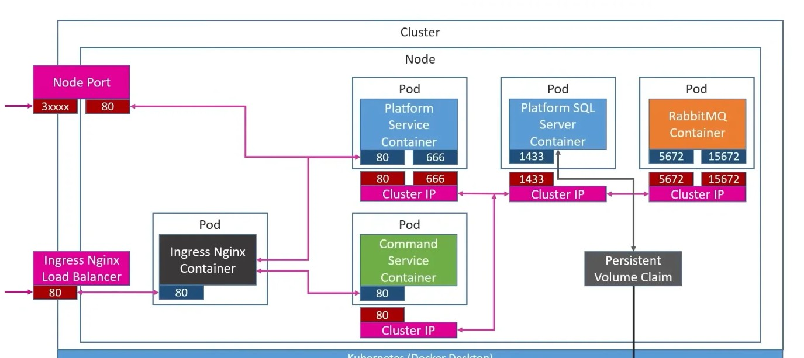

# Microservices app

---

### Description

This is a simple use case built while following this excellent YouTube course:  
[Complete Guide to Microservices with .NET](https://www.youtube.com/watch?v=DgVjEo3OGBI&t=39018s&ab_channel=LesJackson) by Les Jackson.

Although the application itself is simple, the goal of the course is to **demonstrate the architecture and tooling around building real microservices**.

### 🛠 Technologies Used

- **Docker** – for containerizing each service  
- **Kubernetes** – for deploying and managing the services in a cluster
- **RabbitMQ** – for asynchronous messaging between services  
- **gRPC** – for efficient communication between internal microservices  

The course walks through setting up each of these tools and how they integrate into a .NET-based microservices architecture.

---

## Author Info

- Linkedin - [Federico Andrés Jácome Castañeda](https://www.linkedin.com/in/federicojacome/)
- Website - [Portfolio](https://federocky.github.io/PersonalWeb/)

[Back To The Top](#-Microservices-app)
